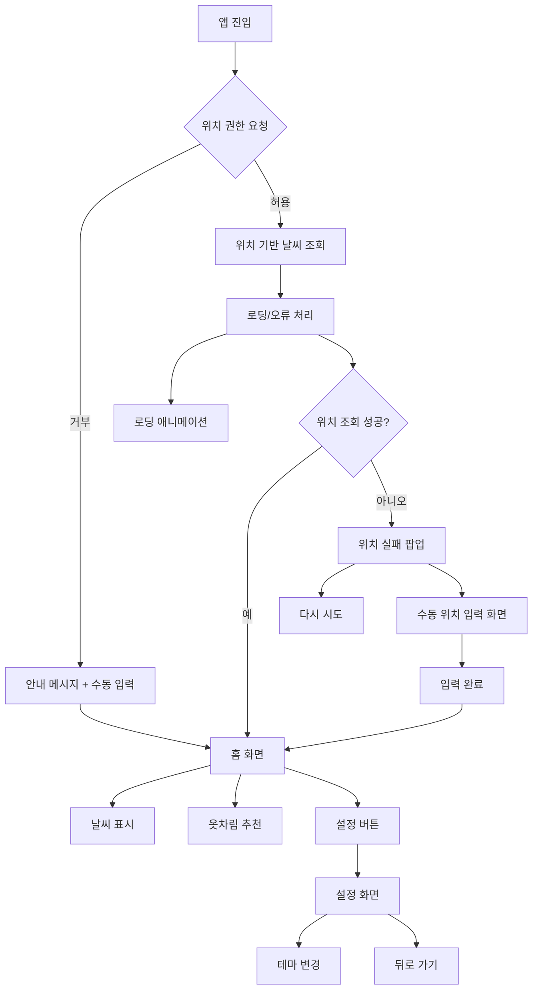

# Capstone Design 03

## 🎨 디자인 방향성

- 📱 **스마트폰 중심 UI**: 사용자는 빠르게 정보를 확인하고 싶어함
- 🪧 **디자인 제작 전 고려 요소**

| 요소 | 디자인 |
|---|---|
| 화면 크기 | 모바일 기준 (갤럭시 S25 기준 384x844) |
| 네비게이션 | 상단 아이콘 버튼 또는 하단 탭 |
| 버튼 스타일 | 터치하기 쉬운 크기, 원형/둥근 직사각형 |
| 페이지 전환 | SPA 방식, 슬라이드/페이드인 |
| 옷차림 카드 | 날씨·기온별 외투, 상의, 하의, 신발 추천 |

---

## 🗂️ 앱 흐름도 (Flowchart)
### [👉 Mermaid Live Editor에서 보기](https://www.mermaidchart.com/app/projects/aa93f360-7b5e-45d0-af7f-864e0c160773/diagrams/5c838077-041d-47ab-8e6e-f328b3e7c4ca/version/v0.1/edit)

### 1. 앱 진입 & 위치 권한 처리
<table>
  <tr> <th colspan="2">앱 실행 시 <b>위치 권한 요청</b></th>                   </tr>
  <tr> <td>📍 허용 시</td>                <td>❌ 거부 시</td>                </tr>
  <tr> <td>위치 기반 날씨 조회 진행</td>   <td>안내 메시지 + 수동 입력 UI</td> </tr>
  <tr> <td>    </td>                      <td>사용자가 직접 위치 입력 후 → 홈 화면으로 진입</td> </tr>
</table>

### 2. 위치 기반 날씨 조회 & 로딩 처리
**허용**시, 위치 기반 날씨 데이터를 조회
- 날씨 API 요청 중에는 ⏳ 로딩 애니메이션 표시

위치 조회 실패 시: ❗위치 실패 팝업 노출
- 선택지:
  + 🔁 다시 시도
  + 📝 수동 위치 입력 화면 → 입력 완료 시 홈으로 이동

### 3. 홈 화면
사용자 위치에 맞는 정보 표시:
- 🧭 날씨 표시
  + 지역명 / 기온 / 날씨 상태
- 👕 추천 옷차림 카드
  + 기온·날씨에 따라 의상 이미지 or 텍스트 제안
- ⚙️ 설정 버튼
  + → 설정 화면으로 이동

### 4. 설정 화면
<table>
    <tr> <th colspan="2">🌙 테마 선택</th> </tr>    
    <tr> <td>💡LIGHT</td> <td>🌙Dark</td> </tr>
</table>

⬅️ 뒤로 가기
  - 홈 화면으로 복귀

---
