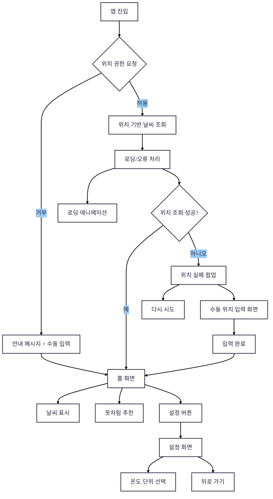

# Capstone Design 03

## 📱 디자인 방향성
서비스 사용자는 빠르고 편하게 확인 원할 것
> 보통 스마트폰 사용

## 🪧 디자인 제작 전 사전 구상 요소
요소 | 디자인
---|---
화면 크기 | 모바일 기준 프레임 - 갤럭시 S25 = 384 x 844
네비게이션 |	상단 아이콘 버튼 or 하단 탭
버튼 스타일 |	터치하기 쉬운 크기, 원형/둥근 직사각형
페이지 전환 |	SPA 방식, 화면 슬라이드 or 페이드인…
옷차림 추천 카드 | 날씨·기온별로 외투, 상의, 하의, 신발 함께 추천

## 🗂️ Wearther 흐름도 (Flowchart)
### [Diagram](https://mermaid.live/edit#pako:eNpNksFq20AQhl9l2GsTAj3qUGjstElp2kN7iqSDiDZ2IJaMKh2CMZhUAREbQopMZaMUBZzEhhYUY5wU8kSe2XfIamMnuu3s__3z785ui-27Nmcaq3lWsw7fq4YD8F6n_h3QbUh_Tk1YX38Hmy1KQ_qfwGLeE_0UaBjT9F-7gDclAOJ3RMOJQiv6Cn3IMU8ATzKKx0BXuRj2zBfH4i7HeUc5qjIuwpMZ4CSmbkq3HXgDFCV4PgB5Asyupa0wVhS-pYtBBGIQ42Sm-lWft5-ZLVV80Jex4iKVLc1X5aNOyT3lY7x5BJrLW5TFbZ3CEWV9wGkozh6XsdtK21lppeQdpXySLcd4HgJ2x_LuQGEmfl6WgM86_hrhVQqLvCOnYpZPuqtLAePJBiUjvE6Apgne_FXmXQV8WQJA_Qy7UTGjyxmdJiXk62rk1B2Jnpy1GqfJ1liDew3r0Jbv2ypwg_l13uAG0-TS5gdWcOQbzHDaErUC3_127OwzzfcCvsY8N6jVmXZgHf2QVdC0LZ9XDy35Txovu03L2XPd17rmFVlLP3ds7lXcwPGZ9rb9BDRAEqE)

### 1. 앱 진입 (메인 화면)

- ✅ **위치 권한 요청** → [허용 / 거부]

  - **허용 시** → 위치 기반 날씨 조회 진행  
  - **거부 시** → 안내 메시지 + 수동 입력 UI (**후순위**)

### 2. 홈 화면

- 🧭 **내 위치 날씨 표시**
  - 위치: `예: 서울시 강남구`
  - 기온: `예: 9.8°C`
  - 날씨: `예: 맑음`

- 👕 **추천 옷차림 카드**
  - 예: `"도톰한 패딩, 목도리 추천"`
  - 날씨 아이콘 + 의상 이미지 or 이름

- ⚙️ **설정 버튼** (우측 상단)
  - → 설정 화면으로 이동

### 3. 설정 화면

- 🌡️ **온도 단위 선택**
  - `°C` / `°F`

- ⬅️ **뒤로 가기**
  - → 홈으로 이동

### 4. (옵션) 오류/로딩 처리

- 로딩 중: 애니메이션 또는 텍스트  
- 위치 정보 실패: 안내 메시지 + 새로고침 버튼
